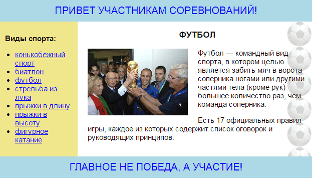

# Лабораторная работа №2

## HTML, CSS. Табличная и блочная верстка

### Вариант 12: Игровая комната в торговом центре

На основе предметной области [лабораторной работы №1](https://github.com/petrik33/BSU-Web-Lab1) создать два проекта.

Первый проект - MAKET\_TABLE -  сверстать макет табличной вёрсткой.

Второй проект MAKET\_DIV - сверстать макет блочной вёрсткой.

Макет для образца:

Вёрстка должна быть резиновой — при изменении ширины окна браузера основная колонка должна растягиваться; ширина колонки с меню должна быть фиксированной.

Гиперссылки могут вести куда угодно. Текст взять из лабораторной работы №1.

Количество пунктов меню должно быть достаточным для того, чтобы при широком окне браузера колонка с меню оказывалась больше по высоте чем основная колонка.